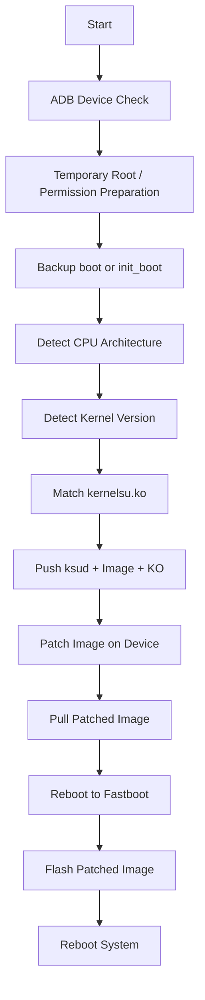

<div align="center">


<br />


<br />
<br />


<br />
<br />


</div>

---

# Android LKM Root Universal Tool

> **By Linuxoid-cn**  
> 一个面向 Android LKM Root / Boot Patch 工作流的跨平台自动化工具集。

本项目用于辅助完成 Android 设备在 Root、启动镜像修补、分区备份、Fastboot 刷入以及原始镜像恢复等流程中的重复操作。  
它不限定于某一个 Root 实现，可用于 KernelSU / KernelSU Next / SukiSU 以及其它基于 `boot` / `init_boot` 修补思路的 LKM Root 工作流。

---

## 项目定位

<div align="center">


</div>

本工具的核心目标是将原本需要手动执行的大量命令流程自动化：

```text
ADB 检测
临时 Root
分区备份
内核模块匹配
镜像修补
修补镜像拉取
Fastboot 刷入
原始镜像恢复
```

让整个流程更加直观、稳定、可重复。

---

## 功能特性

| 模块 | 能力 |
|---|---|
| 跨平台支持 | 支持 Linux 与 Windows 环境 |
| 设备连接 | 自动检测 ADB / Fastboot 状态 |
| 分区备份 | 支持任意分区镜像备份 |
| 启动镜像 | 支持 `boot` / `init_boot` 相关流程 |
| 内核模块 | 根据内核版本自动匹配 `.ko` 文件 |
| 镜像修补 | 支持手机端执行镜像修补 |
| 镜像拉取 | 自动识别并拉取修补后的镜像 |
| Fastboot | 支持自动进入 Fastboot 并刷入 |
| 恢复机制 | 支持恢复原始 `boot` / `init_boot` 镜像 |
| 日志显示 | 彩色日志，关键命令完整输出 |

---

## 工作流概览



---

## 目录结构

```text
Android-LKM-Root-Universal
├── adb.exe
├── fastboot.exe
├── AdbWinApi.dll
├── AdbWinUsbApi.dll
├── bin
│   ├── arm64-v8a
│   │   ├── ksud
│   │   └── libksud.so
│   ├── armeabi-v7a
│   │   ├── ksud
│   │   └── libksud.so
│   └── x86_64
│       ├── ksud
│       └── libksud.so
├── exploit
│   ├── exploit_1
│   ├── exploit_2
│   ├── exploit_3
│   ├── preload-8e5-Ennea.so
│   └── su
├── ko
│   ├── android12-5.10_kernelsu.ko
│   ├── android13-5.10_kernelsu.ko
│   ├── android13-5.15_kernelsu.ko
│   ├── android14-5.15_kernelsu.ko
│   ├── android14-6.1_kernelsu.ko
│   ├── android15-6.6_kernelsu.ko
│   └── android16-6.12_kernelsu.ko
├── backupBoot
├── imageBackup.bat
├── toRoot.bat
├── patchFlash.bat
└── restoreBoot.bat
```

---

## 脚本说明

### `imageBackup.bat`

任意分区备份脚本。

用于在临时 Root 环境下备份指定分区：

```text
init_boot_a
boot_a
persist
abl_a
abl_b
vendor_boot_a
dtbo_a
```

备份结果输出到：

```text
backupBoot
```

---

### `toRoot.bat`

Windows 全流程脚本。

用于自动完成：

```text
检测设备
识别架构
匹配内核模块
推送修补工具
推送启动镜像
执行镜像修补
拉取修补后的镜像
调用刷入流程
```

---

### `patchFlash.bat`

刷入辅助脚本。

用于配合全流程脚本完成修补镜像刷入。

---

### `restoreBoot.bat`

原始镜像恢复脚本。

自动检测：

```text
backupBoot\init_boot.img
backupBoot\boot.img
```

恢复刷入逻辑：

```text
init_boot.img -> init_boot_ab
boot.img      -> boot_ab
```

---

## Windows 使用流程

<div align="center">


</div>

### 1. 备份分区

运行：

```text
imageBackup.bat
```

输入需要备份的分区名，例如：

```text
init_boot_a
boot_a
persist
vendor_boot_a
```

---

### 2. 执行 Root / 修补 / 刷入流程

运行：

```text
toRoot.bat
```

脚本会自动完成镜像修补和后续刷入流程。

---

### 3. 恢复原始镜像

运行：

```text
restoreBoot.bat
```

脚本会自动优先恢复 `init_boot.img`，如果不存在则恢复 `boot.img`。

---

## Linux 使用流程

<div align="center">


</div>

第一版主要适配 Linux 环境。

Linux 用户可根据仓库中的 Linux 脚本执行对应流程：

```bash
chmod +x ./script_name
./script_name
```

具体使用方式请以 Linux 脚本内提示为准。

---

## 内核模块匹配规则

工具会根据设备内核版本自动匹配 `ko` 目录中的模块。

命名格式示例：

```text
android14-5.15_kernelsu.ko
android14-6.1_kernelsu.ko
android15-6.6_kernelsu.ko
android16-6.12_kernelsu.ko
```

脚本会通过：

```text
uname -r
```

解析出类似：

```text
android15-6.6
```

然后匹配：

```text
ko\android15-6.6_kernelsu.ko
```

---

## 日志风格

Windows 脚本采用彩色日志输出：

```text
[+] 正常流程 / 成功
[!] 警告 / 错误
[?] 用户输入
```

日志策略：

```text
等待类命令静默
关键 ADB / Fastboot / dd / pull / push 命令完整打印
减少无意义分隔线
保留关键阶段提示
```

---

## 注意事项

- 请确认 Bootloader 已解锁
- 请确认镜像来自当前设备和当前系统版本
- 不要混刷其它设备或其它系统版本的 `boot` / `init_boot`
- 使用前建议备份原始镜像
- Root、修补、刷入操作均存在风险
- 操作过程中请勿断开数据线
- 如果设备无法启动，可尝试使用 `restoreBoot.bat` 恢复原始镜像

---

## 免责声明

本项目仅供技术交流与学习使用。

Root、刷入镜像、修改启动分区等操作均存在风险，可能导致设备无法启动、数据丢失或其它不可预期的问题。

使用本工具即代表你已了解相关风险，并愿意自行承担由此产生的一切后果。

作者不对因使用本项目造成的任何设备故障、数据丢失或其它损失承担责任。

---

## 作者 / 组织

<div align="center">


</div>

- Organization: **Linuxoid-cn**
- CoolApk: **@Kernix**
- GitHub: <https://github.com/Linuxoid-cn>
- Telegram: **@C_Valmont**
- Email: **jehsianbenites@gmail.com**
```text
backupBoot
```

---

### `toRoot.bat`

Windows 全流程脚本。

用于自动完成：

```text
检测设备
识别架构
匹配内核模块
推送修补工具
推送启动镜像
执行镜像修补
拉取修补后的镜像
调用刷入流程
```

---

### `patchFlash.bat`

刷入辅助脚本。

用于配合全流程脚本完成修补镜像刷入。

---

### `restoreBoot.bat`

原始镜像恢复脚本。

用于将备份目录中的原始镜像恢复刷回设备。

自动优先检测：

```text
backupBoot\init_boot.img
```

如果不存在，则检测：

```text
backupBoot\boot.img
```

恢复刷入逻辑：

```text
init_boot.img -> init_boot_ab
boot.img      -> boot_ab
```

---

## Windows 使用方法

### 1. 备份分区

运行：

```text
imageBackup.bat
```

输入需要备份的分区名，例如：

```text
init_boot_a
boot_a
persist
vendor_boot_a
```

备份文件会保存到：

```text
backupBoot
```

---

### 2. 执行 Root / 修补流程

运行：

```text
toRoot.bat
```

脚本会自动完成镜像修补和后续刷入流程。

---

### 3. 恢复原始镜像

如果需要恢复原始启动镜像，运行：

```text
restoreBoot.bat
```

脚本会自动选择可用备份并刷回对应分区。

---

## Linux 使用方法

第一版主要适配 Linux 环境。

Linux 用户可根据仓库中的 Linux 脚本执行对应流程：

```bash
chmod +x ./脚本名
./脚本名
```

具体使用方式请以 Linux 脚本内提示为准。

---

## 内核模块匹配规则

工具会根据设备内核版本自动匹配 `ko` 目录中的模块。

命名格式示例：

```text
android14-5.15_kernelsu.ko
android14-6.1_kernelsu.ko
android15-6.6_kernelsu.ko
android16-6.12_kernelsu.ko
```

脚本会通过：

```text
uname -r
```

解析出类似：

```text
android15-6.6
```

然后匹配：

```text
ko\android15-6.6_kernelsu.ko
```

---

## 注意事项

- 请确认 Bootloader 已解锁
- 请确认镜像来自当前设备和当前系统版本
- 不要混刷其它设备或其它系统版本的 `boot` / `init_boot`
- 使用前建议备份原始镜像
- Root、修补、刷入操作均存在风险
- 操作过程中请勿断开数据线
- 如果设备无法启动，可尝试使用 `restoreBoot.bat` 恢复原始镜像

---

## 免责声明

本项目仅供技术交流与学习使用。

Root、刷入镜像、修改启动分区等操作均存在风险，可能导致设备无法启动、数据丢失或其它不可预期的问题。

使用本工具即代表你已了解相关风险，并愿意自行承担由此产生的一切后果。

作者不对因使用本项目造成的任何设备故障、数据丢失或其它损失承担责任。

---

## 作者

- 酷安：@Kernix
- GitHub：https://github.com/Linuxoid-cn
- Telegram：@C_Valmont
- Email：jehsianbenites@gmail.com
